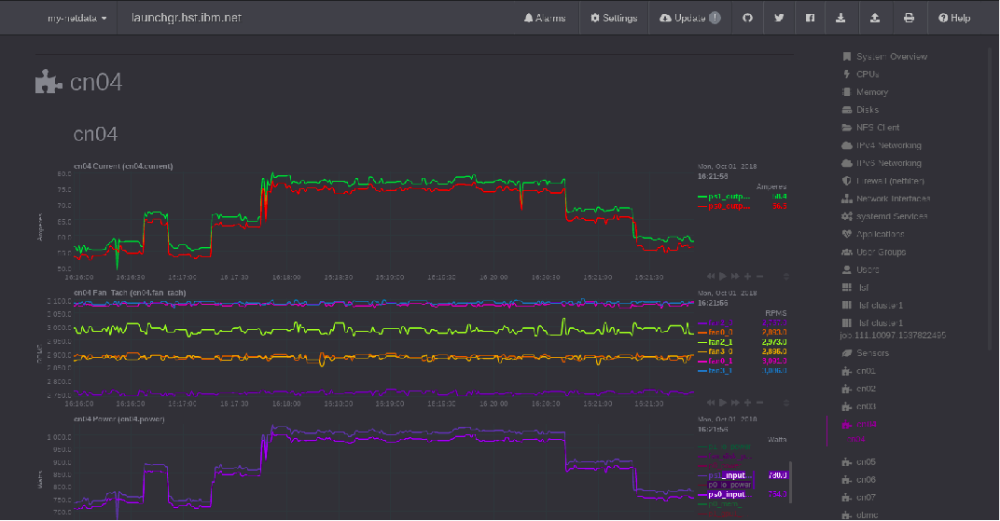
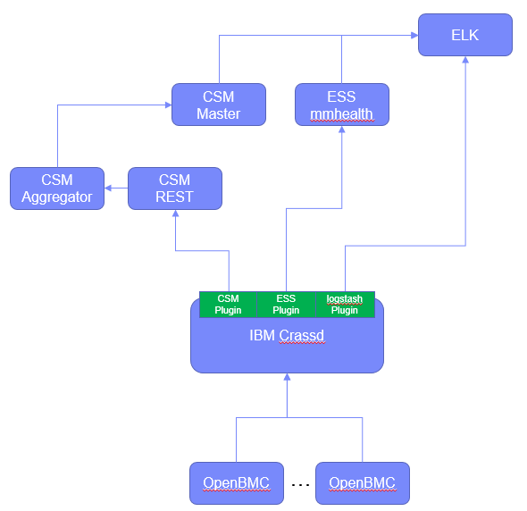

===============
 Introduction
===============

Executive Summary
==================

Cluster monitoring has different requirements based on data center size,
purpose, the amount of available bandwidth for monitoring functions and
the need for 3rd party support. We show a RAS aggregation approach which
leverages open source tools to aggregate sensor and alert data from
OpenBMC’s management interface. Through a highly configurable broadcast
subscription service and an extensible plug-in framework, telemetry data
can be collected, associated with cluster jobs, and nodes actively
monitored without impacting job performance. We demonstrate how AC922
management is possible with Netdata, Kibana, and Grafana.

Introduction
=============

IBM's AC922 system design motivated by the SUMMIT and SIERRA
supercomputer requirements. As a large scale-out system, each
contribution to management network load deserves careful consideration
to ensure quick communication of reliability or failure events and the
flexibility of a prescriptive configuration a requirement.

The AC922 was IBM's first system to use OpenBMC for its onboard system
control. OpenBMC implements a REST API with features motivated by the
Redfish API. These interfaces allow for the configuration of event and
monitoring along with enabling tuning per the desired load on the
cluster management network.

There are several options for cluster management and many administrator
teams have written extensible solutions tailored to their sites. In
supporting a test and development cluster, our goal was to use up to 50%
of the network for system sensor monitoring without adding jitter to
workloads. We explored NetData because of its active community, the
availability of plugins for major cluster functions, and because it was
running for us within a half day after the initial download.

In as much as real time sensor data was important, this is eclipsed by
the importance of the system identifying a functional fault or has
otherwise detected a non-optimal condition. Depending on the cluster
policy, these events may indicate a need for service due to loss of
redundancy or even immediate action. These events are used by cluster
managers, like IBM’s Cluster Service Manager (CSM), to take nodes out of
service for maintenance. We show how these events can be logged to
Logstash and displayed by Kibana or by Grafana.

This white paper documents the architecture of our cluster monitoring
system with the intended audience being administrators who are looking
for an Open Source solution for monitoring an AC922 cluster or
administrators integrating AC922s into existing solutions. In either
situation, the key components are defined in the Key Software Components
table and of those, the IBM Cluster RAS Service Daemon (ibmcrassd), is
the highly configurable cluster aggregator that allows for scalable
processing of node telemetry and system alert propagation.

Key Software Components
========================

============================ ================================================================================================================================================================================================================================================ ================
Open Source Software         Function                                                                                                                                                                                                                                         Host
============================ ================================================================================================================================================================================================================================================ ================
OpenBMC                      Monitors system check-stop, fan failure, vital component deconfiguration, power supply failure, DIMM failure, CPU failure, GPU failure, voltage regulator failure, thermal shutdown, unable to communicate with OCC, hostboot procedure callouts Compute Node BMC
xCAT (optional)              Enables autoconfiguration for ibmcrassd by providing the association BMC IPs and service group in clusters with tiered service node architectures                                                                                                Service Node
Ibmcrassd                    aggregation, event creation, pairing RAS policy to events, plug-in support for downstream processing                                                                                                                                             Service Node
Netdata plugin for ibmcrassd This plugin for NetData allows it to communicate with ibmcrassd service for sensor monitoring                                                                                                                                                    Monitoring node
============================ ================================================================================================================================================================================================================================================ ================

Sensor Monitoring
==================

OpenBMC presents sensor data to the management BMC interface and
receives some from the Host OS. There are 113 sensors that are available
from the BMC’s management interface.

The default for Netdata was to poll data every 1 second. This level of
monitoring requires at worst 21 Kb/s per compute node from the BMC to
the Service node running ibmcrassd and 6.8 Kb/s from the Service node to
the Netdata server per compute node. The connection to the OpenBMC is
more efficient than outlined above, since the OpenBMC only sends a push
notification when the sensor value changes. The 21 Kb/s figure
represents all sensors being updated every second.

In addition to the network load outlined above, the sensor data is
cached by ibmcrassd, using ~21 Kb of memory per monitored node.
Furthermore, the processing of push web-socket notifications from the
BMCs uses 0.3% to 1% of a CPU core per monitored node. Scaled up to 300
monitored nodes, ibmcrassd scales the service with 50 monitored nodes
per CPU core. For example 6 monitoring cores are used to monitor 300
nodes, with each core utilizing 15% to 50% of the core. In addition to
this another core is dedicated to sending data to clients, which uses on
average 0.3% of the CPU core per subscribed client.

To start monitoring sensor readings with Netdata, we installed the
Netdata plugin for ibmcrassd, started ibmcrassd service on the service
node with telemetry enabled in the configuration file, then started the
Netdata service on the monitoring node. The plugin subscribes to the
telemetry stream on the ibmcrassd service, by opening the configured
socket defined by a port number and the IP/hostname. Sensor data
transmissions then begin immediately with sending everything. The plugin
does not take advantage of the filtering and update frequency rates as
it gets all sensors at a rate of once per second. It then updates
Netdata with the sensor values at a rate of once per second.

|image0|

The screen shot above was used to review the power supply balance during
the execution of a CPU GEMM test.

Alerts
=======

The alerts provided by the OpenBMC are used to indicate a change in the
state of the compute node. While the ibmcrassd service does NOT track
the state of each compute node, it aggregates these and enables other
programs to subscribe and use the information for active cluster
management. This is implemented for CSM and designed for easy
integration to existing management frameworks.

The ibmcrassd service converts the base alert provided by the BMCs into
a common format so that all openbmc based machines have a common look
and feel. This is done using a policy table that is specific to a
machine type. These policy tables can be converted and tailored by an
end-user to add or change alert properties in accordance to the service
strategy of the site. In addition to this, the CSM plugin also has its
own policy table, in addition to the base one used for translating the
BMC alerts, so it can be instructed how to react, without needing any
base knowledge of the underlying hardware.

Each endpoint for alerts to the ibmcrassd service is treated as a plugin
that must be enabled for alerts to be forwarded to it. The service
tracks the status and last communication to each endpoint individually,
such that, if communication is lost to an endpoint, it will be resumed,
once the endpoint is back online. This status is tracked in a file that
must be located within persistent storage. To support stateless service
nodes, a persistent storage location can be specified in the ibmcrassd
configuration file.

The following figure shows an example of sending alerts into multiple
systems managers including an IBM proprietary manager for Elastic
Storage Server (ESS), CSM, and Logstash as an entry to an ELK stack.

|image1|

Figure : Example alert flow with ibmcrassd to multiple endpoints

It is important to note that all of the alert management is contained to
a single physical CPU core at any given point in time. It leverages
multiple I/O based threads to process the information as needed. The
service has proven very stable, even in an event storm. When original
put on-line in a cluster with 6 months of old alters, it processed about
over 35,000 alerts from over 4,000 nodes in less than five minutes.

|image2|

Figure : An Example Kibana Dashboard

Scalability
============

The ibmcrassd can effectively monitor up to 288 compute node BMCs with 8
POWER9 grade CPU cores. Its scalable architecture registers a web socket
with each compute node BMC and configures events with OpenBMC.

Using the HTTPS REST API management interface, the ibmcrassd service
first logs into the node to establish a session. It then uses the
session information to subscribe to BMC alerts. An I/O based thread is
used for each monitored node. This will result in a maximum of 288
threads that listen for push notifications.

When an alert notification is received, one of the configured number of
worker threads are woken up to process the node alerts. It then ensures
no alerts were missed by querying the specified BMC for all alerts. Each
event is reviewed against the programmable policy table to extend the
event with node attributes. Each new event is then forwarded to the
configured plugins. The plugin architecture allows downstream archiving
and analysis, active cluster monitoring with event propagation (less
than 20 sec), and visualization. Plugins are currently available for
IBM’s Cluster Service Manager (CSM), Netdata, and Logstash.

For the sensor data stream, more processing power is needed, and the
service had to be made scalable to use multiple physical cores of the
service node’s CPUs. In addition to all of the I/O threads above for
alerts, we again have 288 I/O threads for listening to sensor data with
a web-socket push mechanism. Each of the I/O threads is paired with
another I/O thread that processes the sensor data notification and
stores it into a cache. The updates are then forwarded to the client
subscription sub-process.

A separate CPU core is dedicated to handling client subscriptions to
ensure that the clients receive a responsive interface, regardless of
what the remainder of the ibmcrassd service is handling. Given the
dedication of multiple physical cores, these will appear as multiple
instances of the ibmcrassd service, if for instance, the top command is
run on the service node.

Conclusion
===========

With providing both a live feed of sensor data and alerts to varying
systems managers, hardware centric monitoring no longer requires a
separate management system. Folding nicely into existing open-source
management tools, with great flexibility, a single pane of glass for
systems management becomes possible. This holds true through the two
types of systems management models of distributed vs centralized.

The ibmcrassd service is light enough on systems resources it can be run
alongside systems managers that are distributed, or it can be run on a
centralized service node, to allow for maximum performance of managed
nodes. By fitting both models of management, it will drive consistency
for IBM hardware, regardless of what manager is used, and ensure a
quality production environment is delivered.

Key References
===============

Netdata: https://github.com/netdata/netdata/wiki

Grafana: https://grafana.com/

Logstash (ELK): https://www.elastic.co/elk-stack

OpenBMC: https://www.openbmc.org/

IBM Power System AC922:
https://www.ibm.com/us-en/marketplace/power-systems-ac922

.. |image2| image:: images/image3.png
